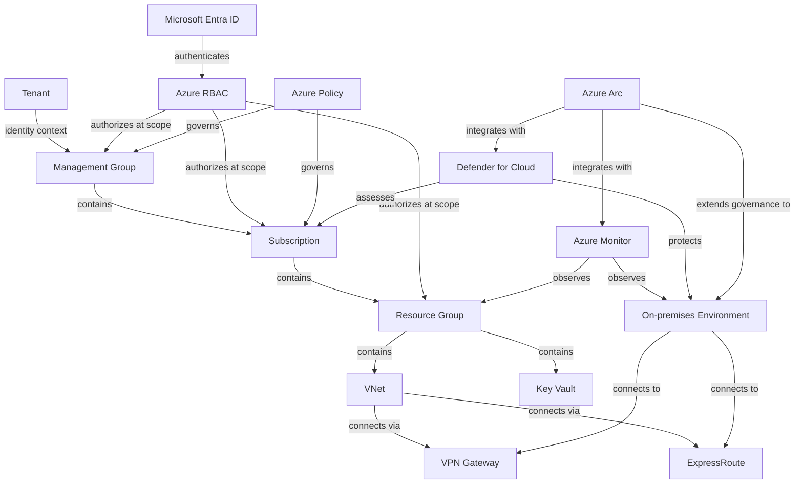

# Azure concepts Mermaid map

```mermaid
flowchart TD
    Tenant["Tenant"]
    MG["Management Group"]
    Sub["Subscription"]
    RG["Resource Group"]
    Entra["Microsoft Entra ID"]
    RBAC["Azure RBAC"]
    Policy["Azure Policy"]
    VNet["VNet"]
    VPN["VPN Gateway"]
    ER["ExpressRoute"]
    KV["Key Vault"]
    Monitor["Azure Monitor"]
    Defender["Defender for Cloud"]
    Arc["Azure Arc"]
    OnPrem["On-premises Environment"]

    Tenant -->|identity context| MG
    MG -->|contains| Sub
    Sub -->|contains| RG
    Entra -->|authenticates| RBAC
    RBAC -->|authorizes at scope| MG
    RBAC -->|authorizes at scope| Sub
    RBAC -->|authorizes at scope| RG
    Policy -->|governs| MG
    Policy -->|governs| Sub
    RG -->|contains| VNet
    RG -->|contains| KV
    VNet -->|connects via| VPN
    VNet -->|connects via| ER
    OnPrem -->|connects to| VPN
    OnPrem -->|connects to| ER
    Monitor -->|observes| RG
    Monitor -->|observes| OnPrem
    Defender -->|assesses| Sub
    Defender -->|protects| OnPrem
    Arc -->|extends governance to| OnPrem
    Arc -->|integrates with| Monitor
    Arc -->|integrates with| Defender

    click Tenant href "./concepts/tenant.md" "Open Tenant card"
    click MG href "./concepts/management-group.md" "Open Management Group card"
    click Sub href "./concepts/subscription.md" "Open Subscription card"
    click RG href "./concepts/resource-group.md" "Open Resource Group card"
    click Entra href "./concepts/entra-id.md" "Open Entra ID card"
    click RBAC href "./concepts/rbac.md" "Open RBAC card"
    click Policy href "./concepts/policy.md" "Open Policy card"
    click VNet href "./concepts/vnet.md" "Open VNet card"
    click VPN href "./concepts/vpn-gateway.md" "Open VPN Gateway card"
    click ER href "./concepts/expressroute.md" "Open ExpressRoute card"
    click KV href "./concepts/key-vault.md" "Open Key Vault card"
    click Monitor href "./concepts/monitor.md" "Open Azure Monitor card"
    click Defender href "./concepts/defender.md" "Open Defender for Cloud card"
    click Arc href "./concepts/arc.md" "Open Azure Arc card"
    click OnPrem href "./concepts/on-prem.md" "Open On-premises card"
```
