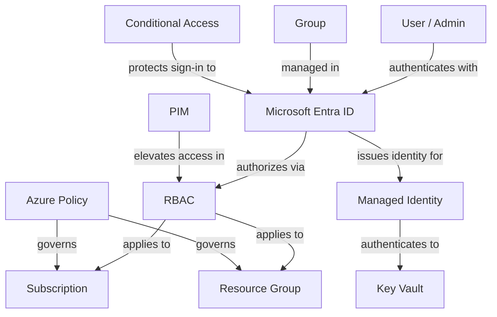

# Azure Identity & Governance Concept Map

```mermaid
flowchart TD
    Entra["Microsoft Entra ID"]
    User["User / Admin"]
    Group["Group"]
    RBAC["RBAC"]
    PIM["PIM"]
    CA["Conditional Access"]
    Policy["Azure Policy"]
    Sub["Subscription"]
    RG["Resource Group"]
    MI["Managed Identity"]
    KV["Key Vault"]

    User -->|authenticates with| Entra
    Group -->|managed in| Entra
    Entra -->|authorizes via| RBAC
    RBAC -->|applies to| Sub
    RBAC -->|applies to| RG
    PIM -->|elevates access in| RBAC
    CA -->|protects sign-in to| Entra
    Policy -->|governs| Sub
    Policy -->|governs| RG
    MI -->|authenticates to| KV
    Entra -->|issues identity for| MI

    click Entra href "./concepts/entra-id.md" "Open concept page"
    click User href "./concepts/user-admin.md" "Open concept page"
    click Group href "./concepts/group.md" "Open concept page"
    click RBAC href "./concepts/rbac.md" "Open concept page"
    click PIM href "./concepts/pim.md" "Open concept page"
    click CA href "./concepts/conditional-access.md" "Open concept page"
    click Policy href "./concepts/azure-policy.md" "Open concept page"
    click Sub href "./concepts/subscription.md" "Open concept page"
    click RG href "./concepts/resource-group.md" "Open concept page"
    click MI href "./concepts/managed-identity.md" "Open concept page"
    click KV href "./concepts/key-vault.md" "Open concept page"
```
