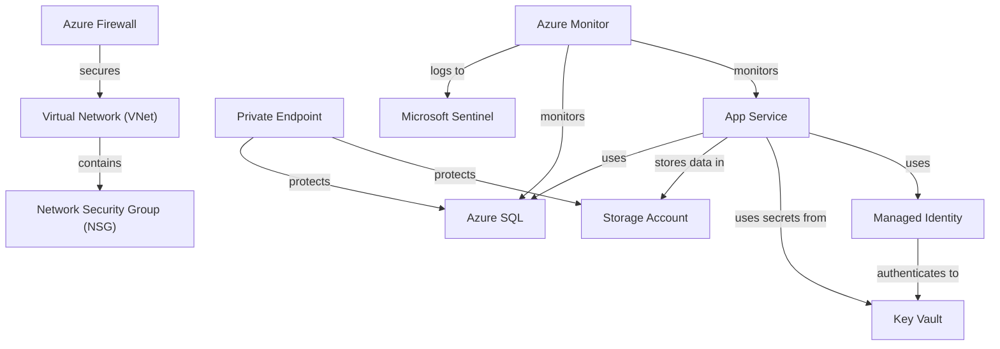

# Azure Security Controls Concept Map

```mermaid
flowchart TD
    VNet["Virtual Network (VNet)"]
    NSG["Network Security Group (NSG)"]
    Firewall["Azure Firewall"]
    PE["Private Endpoint"]
    MI["Managed Identity"]
    KV["Key Vault"]
    App["App Service"]
    Stg["Storage Account"]
    SQL["Azure SQL"]
    Mon["Azure Monitor"]
    Sen["Microsoft Sentinel"]

    VNet -->|contains| NSG
    Firewall -->|secures| VNet
    PE -->|protects| Stg
    PE -->|protects| SQL
    MI -->|authenticates to| KV
    App -->|uses| MI
    App -->|uses secrets from| KV
    App -->|stores data in| Stg
    App -->|uses| SQL
    Mon -->|monitors| App
    Mon -->|monitors| SQL
    Mon -->|logs to| Sen

    click VNet href "./concepts/vnet.md" "Open concept page"
    click NSG href "./concepts/nsg.md" "Open concept page"
    click Firewall href "./concepts/firewall.md" "Open concept page"
    click PE href "./concepts/private-endpoint.md" "Open concept page"
    click MI href "./concepts/managed-identity.md" "Open concept page"
    click KV href "./concepts/key-vault.md" "Open concept page"
    click App href "./concepts/app-service.md" "Open concept page"
    click Stg href "./concepts/storage.md" "Open concept page"
    click SQL href "./concepts/sql.md" "Open concept page"
    click Mon href "./concepts/monitor.md" "Open concept page"
    click Sen href "./concepts/sentinel.md" "Open concept page"
```
